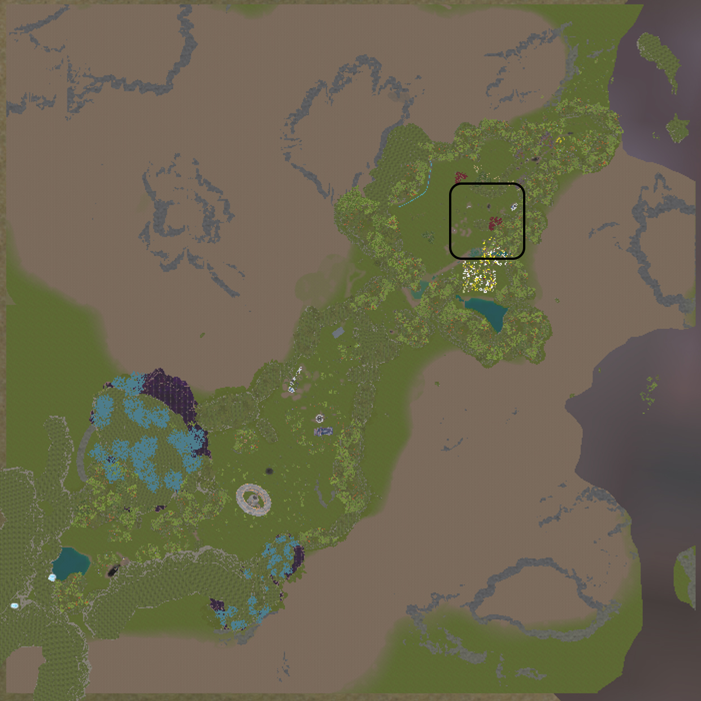
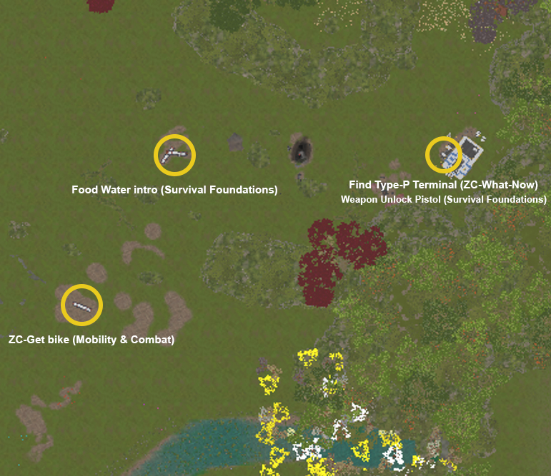

# ZC-Food-Water-Intro

## LocationGroup = FolderName
## Location = File Name
## Location Actions/toDos = Trigger (3 pound ### entries in file name)

---
[]
[]
### Trigger:Suit Hydration Warning
- Trigger Type -> ForcedQuest
- Order 1
- **Cinematic:** No — HUD alert activates
- **BGMusic:** No change — ambient continues
- **Dialogs:**
  - (HUD: HYDRATION RESERVE LOW — NUTRITION RESERVE LOW)
  - Player: Natural water is not worth the risk. I need sealed Zegas supplies.
  - SURD: Correct. Unknown biological contamination probability is unacceptable.
  - Player: So I live on corporate ration packs. Perfect.
  - SURD: Survival preference logged.
- **Objectives:**
  - Locate Zegas food and water containers in the crash zone
- **GameplayNotes:**
  - Establishes the food and water survival rules permanently.
  - No hunting loop. No filling water from natural sources. Zegas containers only.
- Status Draft

---

### Trigger:Find Survival Supplies
- Trigger Type -> ForcedQuest
- Order 2
- **Cinematic:** No
- **BGMusic:** Ambient — light tension, player is exposed while searching
- **Dialogs:**
  - SURD: Containers may include ration packs, sealed water cartridges, suit hydration cells, and emergency nutrient gel.
  - Player: What if a container is damaged?
  - SURD: Scan it first. If the seal is breached, the contents may be contaminated.
  - Player: Scan everything. Got it.
- **Objectives:**
  - Locate Zegas food containers (2 required)
  - Locate Zegas water containers (2 required)
  - Scan each container before opening
  - Store safe supplies in suit inventory
- **GameplayNotes:**
  - Some containers are damaged, locked, or buried under debris.
  - Teach scan-before-open as a habit. One container in this batch should be contaminated to reinforce the rule.
  - Containers in this zone become repeatable supply points for the Food-Water side quests.
- Status Draft
