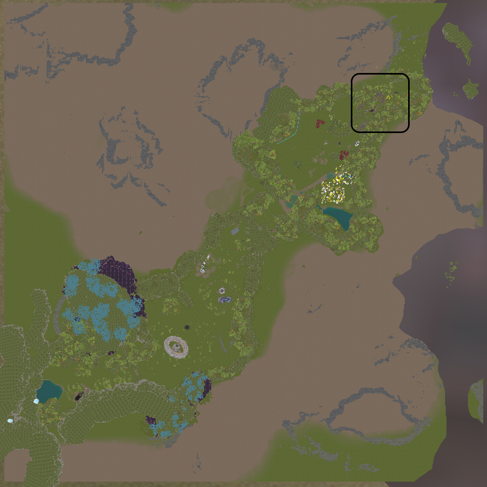
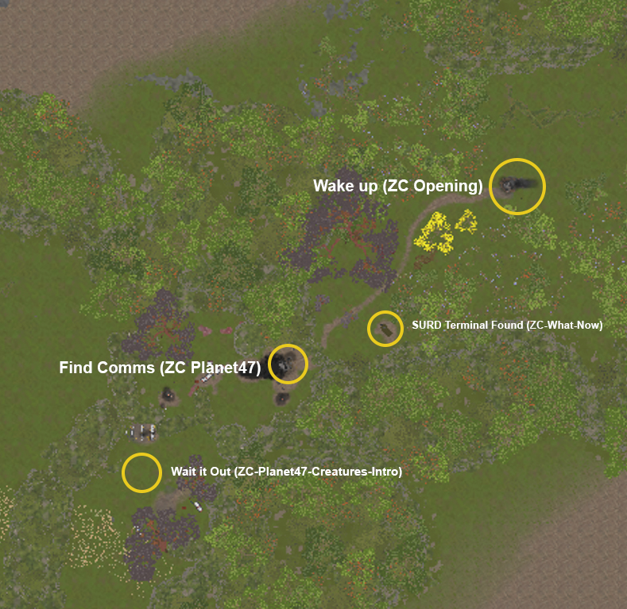

# ZC-Planet47-Creatures-Intro

## LocationGroup = FolderName
## Location = File Name
## Location Actions/toDos = Trigger (3 pound ### entries in file name)

---

[]
[]
### Trigger:Sounds in the Smoke
- Trigger Type -> ForcedQuest
- Order 1
- **Cinematic:** No
- **BGMusic:** Tension build — distant heavy footsteps, snapping branches, deep vocalizations beyond the smoke
- **Dialogs:**
  - Player: (quiet) What is that sound?
- **Objectives:**
  - Move deeper into the crash zone to search for comms
- **GameplayNotes:**
  - Player cannot see the creature yet. Audio only.
  - Creature warning UI does not appear yet — tension without explanation.
- Status Draft

---

### Trigger:What Was That
- Trigger Type -> ForcedQuest
- Order 2
- **Cinematic:** Partial — camera briefly shows a large carnivore dinosaur-like creature moving between burning cargo containers. It sniffs wreckage, reacts to a sound, and turns toward the player's direction.
- **BGMusic:** Low stinger — sudden silence, then slow dread pulse
- **Dialogs:**
  - Player: What the hell are these creatures?
  - Player: Zegas said this planet was uninhabited.
  - Player: Better hide and find comms soon.
- **Objectives:**
  - Hide behind wreckage before the creature detects you
  - Observe the creature from a safe distance
  - Do not engage
- **GameplayNotes:**
  - player reaches marked debris zone
  - Player has no weapon. Combat is not possible.
  - Crouch tutorial: crouch, move slowly, use debris as cover.
  - Creature warning UI appears when visibility or sound risk is high.
  - Creature reacts to movement and sound. Heat vision type — cannot see through thick debris.
- Status Draft

---

### Trigger:Wait It Out
- Trigger Type -> ForcedQuest
- Order 3
- **Cinematic:** No
- **BGMusic:** Held tension — creature breathing audio, slow footsteps, silence when it moves away
- **Dialogs:** None
- **Objectives:**
  - Stay hidden until the creature leaves the search area
- **GameplayNotes:**
  - player reaches cover position
  - Creature patrols for 30 to 45 seconds before moving away.
  - Action group completes when creature exits the zone and player leaves cover.
  - Side quest ZC-Creature-Discover-1 becomes available after this action group completes.
- Status Draft
